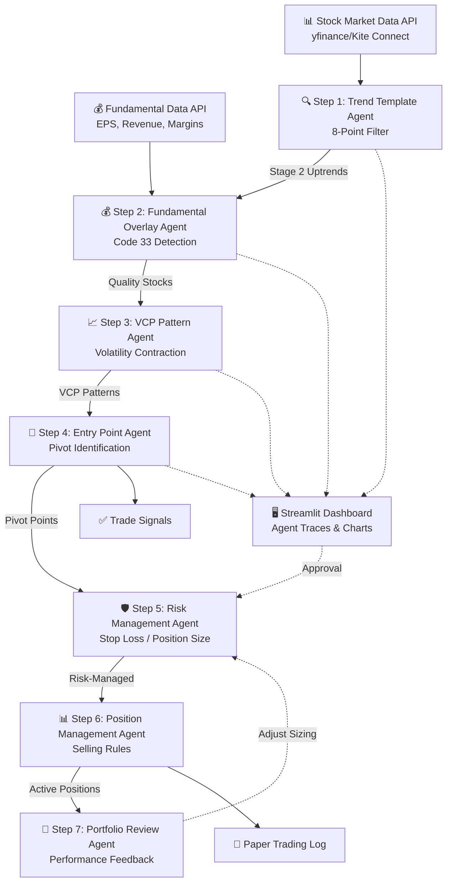

# Minervini SEPA Agentic Trading Workflow - Technical Architecture

## Overview

An agentic AI workflow that emulates Mark Minervini's **Specific Entry Point Analysis (SEPA)** methodology. The system functions as a multi-stage funnel, progressively filtering stocks from a broad universe down to high-probability, low-risk entry points.

Based on patterns from [agentic-workflow-course](file:///Users/dinesh/Documents/Coding/agentic-workflow-course), this architecture uses:
- **Multi-agent pipeline** with sequential handoffs
- **Tool-calling** via aisuite/OpenAI function calling
- **Component-level evaluations** for each filtering stage
- **Feedback loops** for adaptive position sizing

---

## System Architecture



---

## User Decisions (Integrated)

> [!NOTE]
> **Data Source Strategy (MVP)**
> We will use **`yfinance`** for the MVP to target Indian Equities (NSE/BSE). Tickers will be suffixed with `.NS` (e.g., `RELIANCE.NS`) or `.BO`.
>
> **Future Upgrade Path**:
> Migration to **Zerodha Kite Connect** (₹500/mo) or **Shoonya** (Free) for robust live execution and real-time websockets.

> [!NOTE]
> **Scope**
> The system will support a **Dual Mode**:
> 1.  **Scanning**: Screening a fixed universe (e.g., NIFTY 500 tickers).
> 2.  **Watchlist**: analyzing a user-provided list of stocks.

> [!NOTE]
> **Live Trading**
> The architecture will use an **Abstracted Execution Layer** to seamlessly switch between Paper Trading (JSON logs) and Live Execution (Broker API) without changing agent logic.

---

## Proposed Changes

### Project Structure

```
minervini-sepa/
├── Docs/                         # Documentation & Plans
│   ├── implementation_plan.md
│   └── task.md
├── .env                          # API keys (OPENAI_API_KEY, DATA_API_KEY)
├── requirements.txt              # Dependencies
├── app.py                        # Streamlit Dashboard Entry Point
│
├── agents/                       # Agent implementations
│   ├── __init__.py
│   ├── trend_template_agent.py   # Step 1: Trend qualification
│   ├── fundamental_agent.py      # Step 2: Earnings/sales analysis
│   ├── vcp_pattern_agent.py      # Step 3: Volatility Contraction Patterns
│   ├── entry_point_agent.py      # Step 4: Pivot point identification
│   ├── risk_management_agent.py  # Step 5: Stop-loss enforcement
│   ├── position_agent.py         # Step 6: Selling rules
│   └── portfolio_agent.py        # Step 7: Feedback loop
│
├── tools/                        # Tool functions for agents
│   ├── __init__.py
│   ├── market_data_tools.py      # yfinance wrapper
│   ├── fundamental_tools.py      # EPS, revenue, margins
│   ├── technical_tools.py        # Pattern recognition, RS ranking
│   └── execution_tools.py        # Paper/Live order placement
│
├── evaluations/                  # Component-level evals
│   ├── __init__.py
│   ├── trend_eval.py             # Validate trend template criteria
│   ├── pattern_eval.py           # Validate VCP detection
│   └── backtest_eval.py          # Historical performance testing
│
└── data/                         # Local data storage
    ├── watchlist.json            # User's stock watchlist
    ├── paper_trades.json         # Paper trading log
    └── trade_history.db          # SQLite performance database
```

---

### Component Details

#### [NEW] [requirements.txt](file:///Users/dinesh/Documents/Coding/minervini-sepa/requirements.txt)

```
# === Agent + LLM Tools ===
aisuite>=0.1.11
openai
anthropic
python-dotenv
streamlit         # UI Dashboard

# === Stock Data ===
yfinance>=0.2.30  # Market Data (MVP)
pandas
numpy
ta                # Technical analysis library

# === Visualization ===
matplotlib
plotly
mplfinance

# === Database ===
sqlalchemy
tinydb
```

---

#### [NEW] [market_data_tools.py](file:///Users/dinesh/Documents/Coding/minervini-sepa/tools/market_data_tools.py)

Wrapper for `yfinance` tailored for Indian Markets.

```python
def get_stock_data(symbol: str, period: str = "1y") -> dict:
    """
    Fetch historical OHLCV data for a stock.
    Auto-appends .NS if missing for NSE stocks.
    Returns: {prices, volume, 52w_high, 52w_low, current_price}
    """

def calculate_moving_averages(symbol: str) -> dict:
    """
    Calculate 50-day, 150-day, and 200-day SMAs.
    Returns: {sma_50, sma_150, sma_200, sma_200_trend}
    """

def get_relative_strength(symbol: str, benchmark: str = "^NSEI") -> float:
    """
    Calculate RS ranking vs NIFTY 500 (^NSEI) (0-100 scale).
    """

def check_trend_template(symbol: str) -> dict:
    """
    Full 8-point Trend Template check.
    Returns: {passes: bool, details: list[dict], score: int}
    """
```

**Tool Schema Example:**
```python
trend_template_tool_schema = {
    "type": "function",
    "function": {
        "name": "check_trend_template",
        "description": "Verify if a stock meets Minervini's 8-point Trend Template criteria for Stage 2 uptrend qualification.",
        "parameters": {
            "type": "object",
            "properties": {
                "symbol": {
                    "type": "string",
                    "description": "Stock ticker symbol (e.g., 'RELIANCE', 'TCS')"
                }
            },
            "required": ["symbol"]
        }
    }
}
```

---

#### [NEW] [fundamental_tools.py](file:///Users/dinesh/Documents/Coding/minervini-sepa/tools/fundamental_tools.py)

```python
def get_earnings_data(symbol: str) -> dict:
    """
    Fetch quarterly EPS data and calculate acceleration.
    Returns: {eps_history, eps_growth_rates, is_accelerating}
    """

def check_code_33(symbol: str) -> dict:
    """
    Check for 'Code 33' - simultaneous acceleration in EPS, Sales, Margins.
    Returns: {eps_accelerating, sales_accelerating, margins_expanding, is_code_33}
    """
```

---

#### [NEW] [technical_tools.py](file:///Users/dinesh/Documents/Coding/minervini-sepa/tools/technical_tools.py)

```python
def detect_vcp_pattern(symbol: str, lookback_days: int = 60) -> dict:
    """
    Detect Volatility Contraction Pattern (VCP).
    Returns: {
        is_vcp: bool,
        contractions: list[{depth_pct, duration_days}],
        pivot_price: float,
        volume_dry_up: bool
    }
    """

def identify_pivot_point(symbol: str) -> dict:
    """
    Find the pivot/breakout point from the tightest consolidation.
    Returns: {pivot_price, stop_loss_price, risk_pct}
    """
```

---

#### [NEW] [execution_tools.py](file:///Users/dinesh/Documents/Coding/minervini-sepa/tools/execution_tools.py)

```python
class ExecutionHandler:
    def __init__(self, mode: str = "PAPER"):
        self.mode = mode  # 'PAPER' or 'LIVE'
        
    def place_order(self, symbol: str, side: str, qty: int, price: float = 0):
        if self.mode == "PAPER":
            self._log_paper_trade(symbol, side, qty, price)
        elif self.mode == "LIVE":
            self._execute_broker_api(symbol, side, qty, price)
            
    def _log_paper_trade(self, symbol, side, qty, price):
        # Writes to data/paper_trades.json
        pass
```

---

### Dashboard (Streamlit)

**`app.py` Features:**

1.  **Pipeline Visualization**:
    -   Display the "funnel": Total Stocks -> Trend Qualifiers -> VCP Candidates -> Buy Signals.
2.  **Agent Traces**:
    -   Expandable views to see LLM logs and tool calls for a specific stock analysis.
3.  **Signal Approval**:
    -   List of generated Buy Signals.
    -   "Approve" button to trigger `ExecutionHandler`.

---

## Verification Plan

### Automated Tests

| Test | Command | Description |
|------|---------|-------------|
| Unit: Trend Template | `pytest tests/test_trend_template.py` | Validate 8-point criteria calculation (Indian stocks) |
| Unit: VCP Detection | `pytest tests/test_vcp_pattern.py` | Test pattern recognition with known VCPs |
| Unit: Risk Calc | `pytest tests/test_risk_management.py` | Verify stop-loss and position sizing |
| Integration: Pipeline | `pytest tests/test_pipeline.py` | End-to-end flow with mock data |
| Backtest | `python backtests/run_backtest.py` | Historical performance on known winners |

### Component-Level Evaluations

```python
def evaluate_trend_filter(results: dict, expected_passes: set[str]) -> tuple[bool, str]:
    """
    Check if the Trend Template agent correctly identifies known Stage 2 stocks.
    Returns: (pass_flag, markdown_report)
    """
```
